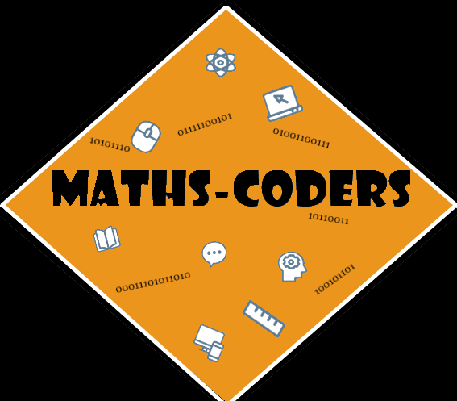

<h1>Team Maths-coders</h1>

  

 

## 📝 Table of contents

- [Description](#description)
- [Built Using](#built_using)
- [Documents](#documents)
- [Our Team](#our_team)

## 💻 Description 

The task was to make a math game that would be interesting and appeal to people. We tried to make the game as interesting as possible. The objective of the game is to reach the finish line with your car by answering 10 questions correctly. You have only 60 seconds and you can choose different difficulty levels, which are easy, medium and hard.

## ⚒️ Built Using 

- [Visual Studio](https://visualstudio.microsoft.com/) - Application
- [Word](https://www.microsoft.com/en-us/microsoft-365/word) - Documentation
- [PowerPoint](https://www.microsoft.com/en-us/microsoft-365/powerpoint) - Presentation
- [Excel](https://www.microsoft.com/en-us/microsoft-365/excel) - QA Documentation

## 📄 Documents 

- Documentation
- Presentation
- Test Plan
- Game Testing

## 🧑🏻‍💻 Our Team 

- <a href = "https://github.com/RAAleksandrov21"> Radomir Aleksandrov </a> (Scrum Trainer)
- <a href = "https://github.com/SSPopov21"> Stanimir Popov </a> (QA Engineer)
- <a href = "https://github.com/EEMustafa21"> Enis Mustafa </a> (Back-end Developer)
- <a href = "https://github.com/SZGeorgiev21"> Stilian Georgiev </a> (Front-end Developer)
